# Machine Learning : Group 12  

Course Instructor : Dr. Subhankar Mishra

* * *

Group Contributors
------------------

Group Repository : [Link](https://github.com/ShashankSaumya123/WBC-Classification)

*   Girish Tripathy  
    1811072, School of Physical Sciences, NISER  
    [Github](https://github.com/girish0409)
*   Shashank Saumya  
    1811143, School of Physical Sciences, NISER  
    [Github](https://github.com/shashanksaumya123)

* * *

## Title of the project :  
Multiclass classification of White blood cells using Convolutional Neural Network (CNN)  

* * *

### Biological Background of the project

WBCs (White Blood cells) also known as leukocytes are the cells of immune system that are involved in protecting the body against both infectious invaders and foreign diseases.  
Depending upon the presence of small structures known as granules, WBCs are classified into two different types:

*   Granulocytes: Presence of Granular cytoplasm
*   Agranulocytes: Absence of Granular cytoplasm

Depending upon the type of nucleus, Granulocytes and Agranulocytes are furthur divided into different types  
  
Granulocytes:

*   Basophil: About 0.4% in adults. Responsible for allergic and antigen response by releasing a chemical called histamine. Since they are rarest of the WBC and share similarities between other types of cell, they are difficult to study, hence we dont have any data of the same.
*   Eosinophil: About 2.3% in adults. Can be distinguished as it has Bi-lobed nucleus. It rises in responce to allergies, parasitic infections and disease of the spleen and central nervous systems.  
    
*   Neutrophil: About 60-70% in adults. Can be distinguished as it has Multilobed nucleus. Responsible for protection against bacterial or fungal infections.  
    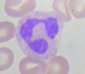

  
Agranulocytes:

*   Monocyte: About 5.3% in adults. Can be distinguished as it has the largest nucleus. Responsible for phagocytoses of used up neutrophils.  
    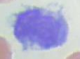
*   Lymphocyte: About 30% in adults. Can be distinguished as having an eccentric nucleus.  
    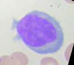

### Motivation and plans :

There is a need to quickly identify blood cells at bulk in the medical field. We propose using a CNN to build a machine which can classify the stained cells to the type of WBCs. The reason we use CNN is because it is known for its high accuracy when it comes to image recognition.

We plan to first get the RGB info on each pixel of the image. The stained cells are of a different colour from the other cells so it would be easier to identify the pixels which contain the WBC under inspection. Then we will use a CNN and train it to get a model which will be able to classify an image containing a stained WBC.

### KYD : Know Your Dataset

The dataset we will using is [WBC Classification dataset](https://www.kaggle.com/paultimothymooney/blood-cells) uploaded on Kaggle by Paul Mooney.  
The database consists of about 10,000 images of White blood cells, divided into 4 different classes. Each class have about 2500 RGB images of dimention 320 x 240.

* * *

### Midway plans and Work Division :

Our Midway plans are follows

*   Learn about neural networks from various sources.
*   Cleaning our data and Preprocessing.
*   Have a simple CNN model trained and ready to predict.

Post midway, we will be exploring methods and layers to make our algorithm and model better in terms of accuracy.  
Work Division :

*   Refinement and preparing the dataset : Shashank (Image to data squeezing, reshaping, etc), Girish (Finding the Optimal way to work with the data)
*   Planning and coding the model :- Girish + Shashank
*   Report Writing, presentation and [Webpage](https://www.niser.ac.in/~smishra/teach/cs460/2021/project/21cs460_group12/) maintainance : Girish

* * *

Midway Works :
==============

* * *

Up till now we have done the following:

*   Learnt about the theory behind NN and CNN.
*   Read the relevant papers.
*   Done some experimentation of various dataset including ours.

* * *

What is a NN and CNN?
---------------------

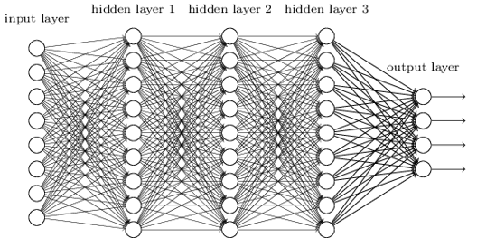  
Neural Network (NN) also known as Artificial Neural Network (ANN), as the name suggests is a network of neurons or nodes and forms the basis of Machine Learning and heart of the deep learning algorithms.  
It mimics a network of biological neurons. All the different neurons or nodes are connected to each other by weights giving a layer liked structure. A positive weight corresponds to excitory connection and a negative weight corresponds to inhibitory connections.  
These weights can be found out or calculated during the traning of the machine learning model.  
The first layer of a NN is known as input layer, the last layer is known as output layer. The layers in between both, are hidden layers. The number of hidden layers is decided considering the dataset and complexity of the model.  
Backpropagation is an important algorithm by which a neural network learns from its own mistakes.  
  
There are various types of Neural networks like Artificial neural network (ANN), Convolutional Neural Network (CNN), Recurrent Neural Network (RNN), Long short term memory neural network (LSTM) etc. Each type of Neural network have its own uses.  
  
Neural Network that is frequently used for image classification is Convolutional Neural network (CNN). CNN is a type of NN containing a layer known as "convolution layer".  
A convolution layer has multiple filters, each filter tries to find a particular pattern. Lets say we are trying to classify an image into birds. A convolution layer will have multiple filters, like a beak filter which detect pattern in beaks of the bird, or a eye filter which detects eye of a bird. These filters or nodes will activate nodes of another convolution layer which might have a head filter or a body filter. When all the required filters or nodes get activated, the output layer will gives us the type of bird we are trying to classify bases on the input of the hidden layers.  
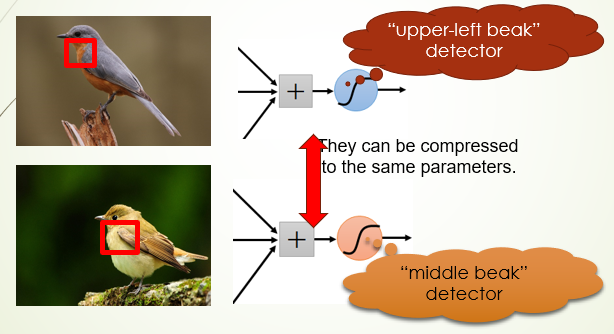  
  
We will be using Sequencial method from the Keras API in tensorflow library to build our model. We will also be using other functions and methods for preprocessing of the image and further tweaking of the model.  
  
The CNN model we have, has different Conv2D layers, pooling layers and Dense layers. The number of each of these layers is a hyperparameter we can tune and test. Our basic CNN is illustrated by the image below  
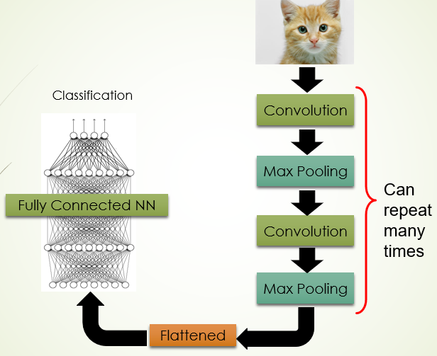

* * *

Some Analysis of the papers
---------------------------

* * *

### Paper 1

*   Important points and analysis on Paper 1: WBC Classification using CNN by Mayank sharma, Aishwarya Bhave and Rekh Ram Jaghel
    *   Use the same WBC data (with some augmentation and downsizing).
    *   Use a 7 layered (LeNet) CNN model.
    *   Tried for different epochs and Learning rates.
    *   Best results at 20 epochs and 0.001 Learning rate (0.8793 Accuracy).
*   Important points and analysis on Paper 2: Counting and Classification of WBC using ANN by Shubham Manik, lalit Mohan Saini and Nikhil Vadera
    *   They have the image of a slide which contains multiple WBCs.
    *   Used Image Segmentation Techniques namely, Cell and Nucleus Segmentation.
    *   Morphological features are extracted like, Cell area, nucleus area, area ratio, number of lobules in nucleus, etc.
    *   Use NN to perform multiclass Classification on these new feature vectors.
    *   However, they only had 90 leukocyte (WBC) samples which is a very small dataset.
    *   The accuracy was around 98.9%.

* * *

### Various experiments we have done. [Link](https://github.com/Girish0409/21cs460_group12/tree/main/Code%20and%20Data) to the codes

|**Experiment No.**|**Dataset**|**Model**|**Optimiser**|**Activation Function**|**Training Accuracy**|**Testing Accuracy**|
|:----------------:|:---------:|:-------:|:-----------:|:---------------------:|:-------------------:|:------------------:|
| 1 | Mnist | NN Single Layered | Adam | Sigmoid | 98 % | 93 % |
| 2 | Mnist | NN Multi Layered | Adam | Sigmoid | 99 % | 98% |
| 3 | Cifar10 | NN Multi Layered | SGD | Sigmoid | 99 % | 55 % |
| 4 | Cifar10 | NN Multi Layered | Adam | Softmax | 98 % | 48 % |
| 5 | Cifar10 | NN Multi Layered | SGD | Softmax | 98% | 56 % |
| 6 | Cifar10 | CNN Multi layered | Adam | Softmax | 93 % | 68% |
| 7 | WBC | CNN Multilayered | Adam | Softmax | 100 % | 48% |

* * *

### Future ideas and comments on the current experiments

*   Understand LeNet and if possible come up with a better model/layer combination.
*   Our CNN model is getting overfitted on the databases. This is probably due lack of data augmentation. To tackle that, we are thinking to do the following:
    *   Use data augmentation, resizing etc.
    *   Use image segmentation method to separate the nucleus from the image, and train the model on that.
    *   Use GridSearchCV for tuning of hyperparameters.

* * *

Final Works
===========

* * *

Till now we have been able to do the following:

*   Generated data from image augmentation, but could not train our model on the same due to "Out of memory errors".
*   Did image segmentation techniques to extract the nucleus from the image.
*   Tried out regularisation techniques to tackle overfitting.
*   Tried out Keras Tuner for hyperparameters.

* * *

### Image Augmentation

Image augmentation is a technique to produce more data from an existing dataset. This helps the model to train on a wider range of Dataset and hence train more efficiently.  
For the Image augmentation we have used Image Data Generator function from the Keras API in Tensorflow Library. The augmentation parameters are as given below  
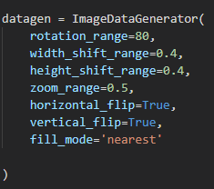  
The function driving this generator, gets the image, turns it into an array, applies the augmentations and saves the image to a given directory using .flow function in the Image Data generator.

* * *

### Image Segmentation

As we observed earlier, the original image dataset didnt give us good results so we went with segmentation. Our aim was to extract the image of the nucleus and/or cell, and train our model on the same.  
We explored 2 image segmentation techniques, known as cell segmentation and nucleus segmentation.  

*   Cell Segmentation:  
    The summary of the method is shown in the figure below.  
    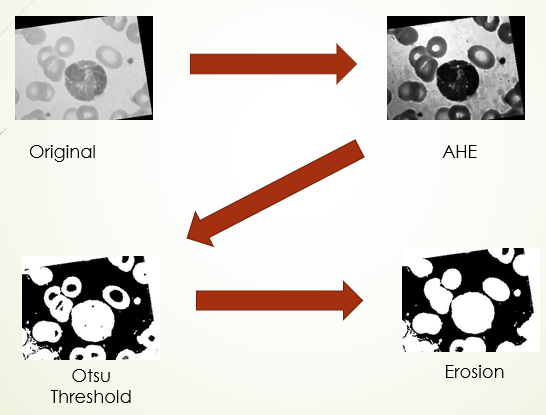  
    We began with taking the grayscale image and apply Adaptive Histogram Equalisation (AHE) on it. AHE is a technique that improves the contrast difference in the image. Then, different thresholding algorithms were tested on it. Thresholding is a technique where you select a threshold and make all values above it 1 and below it 0. This left us with binary image with black background containing white holes at the postition of the cells. The thresholding algorithms that worked well were otsu, isodata and mean thresholding. After that we used erosion for hole filling. Erosion is a technique which removes small black areas within larger white areas. We got good results for images with otsu thresholding only. So, we dropped the other thresholding algorithms. Then, finally using Image opening we were supposed to get rid of all white holes except for the one with WBC. However, we were unable to achieve this. So, instead we had to go with Nucleus Segmentation.
*   Nucleus Segmentation:  
    The summary of the method is show in the figure below.  
    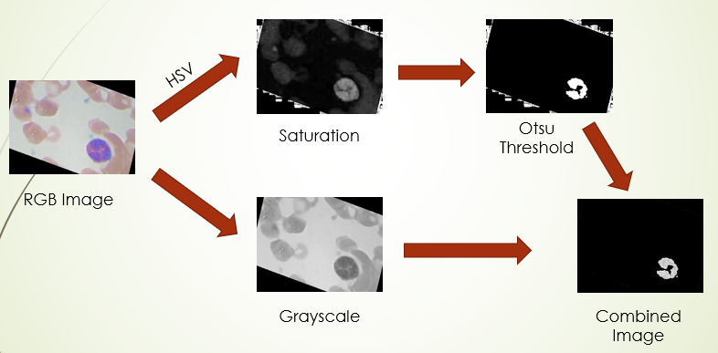  
    First the RGB values of image is converted into HSV values where, H = Hue, S = Saturation and V = Value. Then we separate the saturation image and treat it as a separate grayscale image. The reason for this is because the stained nucleus has a considerabely higher saturation value as compared to other regions in the image. Then using a threshold, we were able to separate them. Three different algorithms gave us decent results. They were otsu, isodata and minimum thresholding. However, none of them worked perfectly for every image. So, we compared the results of each thresholding algorithm for random samples from the data and finally settled on otsu thresholding. Now we have a binary image with white nucleus and black background. Then we multiplied its values with the original grayscale image to crop out the region containing the nucleus.

* * *

### Regularisation

Apart from augmentation and segmentation, another technique used for solving the overfitting problem is a technique called Regularisation.  
There are different types of regularisations known as L1 regularisation, L2 regularisation, Dropout regularisation etc. For CNN models, Dropout regularisation is widely used.  
  

#### Dropout Regularisation

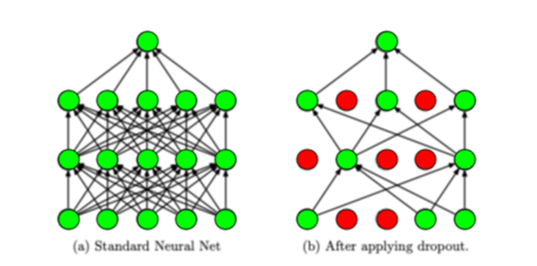  

As the name suggests, dropout regularisation layer "drops out" or ignores a given percentage of nodes in a layer while training an epoch or it can be said that it temporarily removes those particular nodes from the network. The nodes are randomly selected in each iteration. The dropping percentage is again a hyperparameter that can be tuned, although in many papers it is said that, ideal dropout parameter for a hidden layer is between 0.5 to 0.8.

* * *

Experimentations and different models : [Link](https://github.com/Girish0409/21cs460_group12/tree/main/Code%20and%20Data/Post%20Midway) to the codes
----------------------------------------------------------------------------------------------------------------------------------------------------

  

*   **Model 1:**
  
    Base Model,  CNN Multilayered,  Adam Optimiser,  Softmax Activation,  Training : 99.97 %,  Testing : 27.51%
    
  
    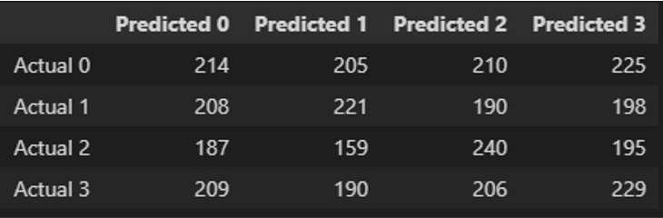  
    As it can be observed from the confusion matrix, the model is a overfitted one. This model is used as a base model and all the hyperparameter tuning is done on this model
  
*   **Model 2:**
    
    Added Nucleus segmentation (upto otsu threshold only), CNN Multilayered, Adam Optimiser, Softmax Activation, Training : 98 %, Testing : 70 %
    
      
    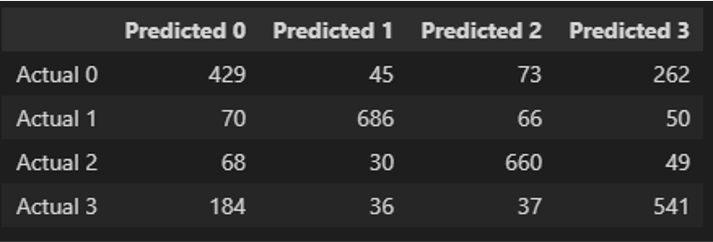  
    This model with nucleus segmentation worked a little better than the previous one, so we are on the right direction.
  
*   **Model 3:**  
    
     Added a dropout layer, CNN Multilayered, Adam Optimiser, Softmax Activation, Training : 83 %, Testing : 74 %
    
      
      
    Adding a dropout regularisation layer made the training accuracy a bit better.
  
*   **Model 4:**
    
     Image segmentation 2.0 (Complete Nucleus Segmentation), CNN Multilayered, Adam Optimiser, Softmax Activation, Training : 98.74 %, Testing : 72 %
    
      
    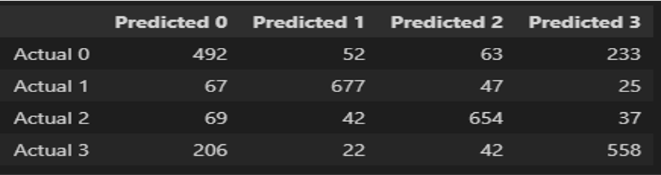  
    
  
*   **Model 5:**
    
     Image Segmentation 2.0 with dropout layer, CNN Multilayered, Adam Optimiser, Softmax Activation, Training : 89.74 %, Testing : 77 %
    
      
    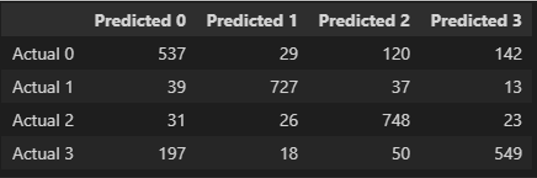  
    This is by far, the best model we were able to get by hyperparameter tuning.

* * *

### Problems so far and possible fixes

*   Unable to train on the augmented data, can be solved by doing batchwise training of model on the augmented images.
*   In some images the nucleus segmentation does not work properly.
*   Model is getting confused in Class 1 (Eosinophil) and class 4 (Neutrophil). Probably due to the similar structure of nucleus.

* * *

Relevant Paper and Sources:
---------------------------

*   Sharma M., Bhave A., Janghel R.R. (2019) White Blood Cell Classification Using Convolutional Neural Network. In: Wang J., Reddy G., Prasad V., Reddy V. (eds) Soft Computing and Signal Processing. Advances in Intelligent Systems and Computing, vol 900. Springer, Singapore. https://doi.org/10.1007/978-981-13-3600-3\_13. [Link](https://link.springer.com/chapter/10.1007/978-981-13-3600-3_13)
*   S. Manik, L. M. Saini and N. Vadera, "Counting and classification of white blood cell using Artificial Neural Network (ANN)," 2016 IEEE 1st International Conference on Power Electronics, Intelligent Control and Energy Systems (ICPEICES), 2016, pp. 1-5, doi: 10.1109/ICPEICES.2016.7853644. [Link](https://ieeexplore.ieee.org/abstract/document/7853644)
*   Image recognition using convolutional neural network combined with ensemble learning algorithm, Weilong Mo et al 2019 J. Phys.: Conf. Ser. 1237 022026 [Link](https://www.researchgate.net/publication/334426609_Image_recognition_using_convolutional_neural_network_combined_with_ensemble_learning_algorithm)
*   Q. Li, W. Cai, X. Wang, Y. Zhou, D. D. Feng and M. Chen, "Medical image classification with convolutional neural network," 2014 13th International Conference on Control Automation Robotics & Vision (ICARCV), 2014, pp. 844-848, doi: 10.1109/ICARCV.2014.7064414. [Link](https://ieeexplore.ieee.org/document/7064414)
*   Jiaohua Qin, Wenyan Pan, Xuyu Xiang, Yun Tan, Guimin Hou, A biological image classification method based on improved CNN, Ecological Informatics, Volume 58, 2020, 101093, ISSN 1574-9541, https://doi.org/10.1016/j.ecoinf.2020.101093. [Link](https://www.sciencedirect.com/science/article/abs/pii/S1574954120300431)
